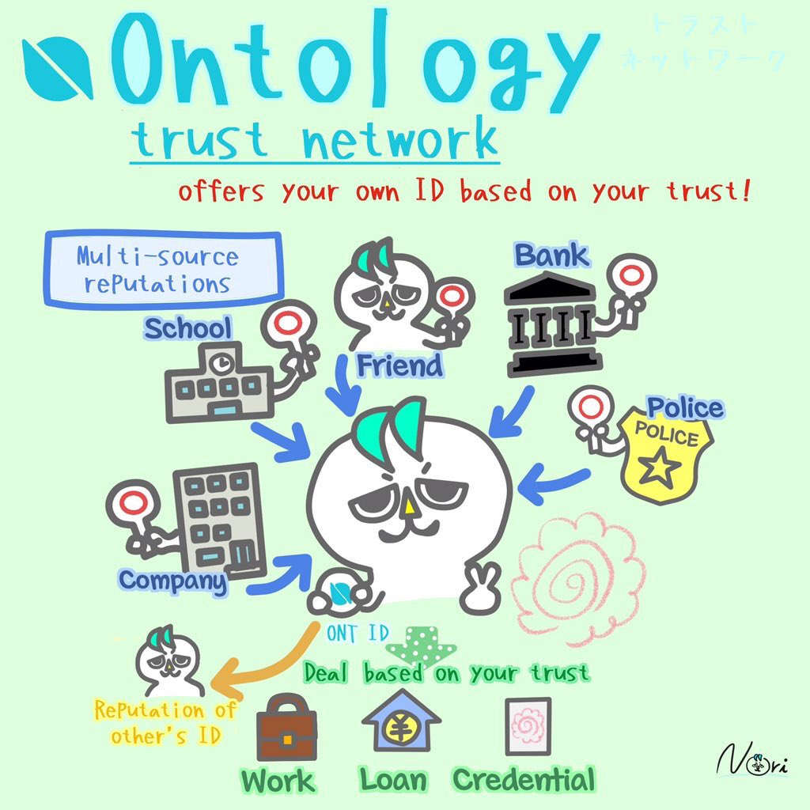

# 本体去中心化数据交易框架密码学组件

## 1. 基于 ONTID 的加解密服务

### 1.1. 加密流程

数据的加密有三个主要步骤:

- 获取公钥：访问本体区块链中的智能合约，基于数据请求方的 `ONT ID` 获取相应的公钥 `pk`。
- 随机采样：随机采样256比特数据，得到高级加密标准（AES）密钥 `key`。
- 加密：将 AES256 密钥使用公钥加密算法（PKE）进行加密得到 `ekey`，明文数据 `m` 使用 AES256-GCM 加密得到密文数据 `c`。

<div align=center></div>

### 1.2. 解密流程

- 获取私钥：根据 `ONT ID` 和 `PKIndex`，从私钥管理模块中找出对应私钥 `sk`。
- 解密对称密钥：使用私钥 `sk` 解密出加密后的密钥 `ekey` 得到 AES 对称密钥 `key`。
- 解密数据： 使用 AES 对称密钥 `key` 解密密文数据 `c` 得到明文数据 `m`。

## 2. 基于口令的密钥派生函数 （PBKDF）

在密码学中，基于口令的密钥派生函数 (PBKDF) 是一类具有滑动计算成本的密钥派生函数，旨在减少加密密钥在面对暴力攻击时的脆弱性。

在去中心化数据交易框架中，密钥派生算法使用的哈希函数是 `SHA256`，算法如下：

- 输入：`seed`、派生密钥长度 `dkLen`(以bit作为计量单位)。
- 输出：长度为 `dklen` 的派生密钥 `key`。

```python
def pbkdf2(seed: str or bytes, dk_len: int) -> bytes:
    key = b''
    index = 1
    bytes_seed = str_to_bytes(seed)
    while len(key) < dk_len:
        key += sha256(b''.join([bytes_seed, int_to_little_bytes(index)]))
        index += 1
    return key[:dk_len]
```

## 3. 基于椭圆曲线的整合加密方案（ECIES）

基于椭圆曲线的整合加密方案是一种由 Victor Shoup 在2001年提出的混合加密体系。Shoup 的提案可以在[这里](https://www.shoup.net/papers/iso-2_1.pdf)找到。

## 4. 本体分布式身份框架 （ONT ID）

本体身份数字身份标识（简称为 ONT ID）是一个建立在 W3C 数字身份标识规范基础之上的分布式身份标识协议。ONT ID 为每个实体建立了一个以密码学为基础的数字身份，实现了数据授权的自主性以及所有权的确认，这使得身份和数据成为了用户真正可以控制的资产。

如果你对 ONT ID 感兴趣，你可以在[这里](https://ontio.github.io/documentation/ontology_DID_zh.html)找到更多的信息。

<div align=center></div>

